  <!-- ==========================================================================
       HERO BANNER: DYNAMIC WAVING GRADIENT & SYNTHWAVE HORIZON
       ========================================================================== -->
  

  <!-- DYNAMIC TYPING SUBTITLE -->
  

   

  <!-- QUICK SOCIAL & PROFILE ACTION BADGES -->
  

    
    
    
    
    
  

  <!-- PROFILE VISITOR COUNTER -->
  

---

### 👨‍💻 About Me

> *"Building seamless digital experiences through robust full-stack architecture, elegant code, and creative 3D shaders."*

- 🎓 **Education**: Currently pursuing **Master of Computer Applications (MCA)** at **Mepco Schlenk Engineering College**, Sivakasi.
- 📜 **Undergraduate**: Graduated **B.Sc Information Technology** with **First Class & Distinction** from **Sri Kaliswari College**, Sivakasi.
- 🔭 **Current Focus**: Designing high-throughput full-stack web applications using **React.js**, **Python**, and **Firebase Firestore**.
- 🧩 **Algorithmic Problem Solving**: Sharpening Data Structures & Algorithms daily on [LeetCode (@Mohan_K_2026)](https://leetcode.com/u/Mohan_K_2026/).
- 🌐 **Creative Tech & 3D**: Experimenting with procedural GPU noise, raw WebGL flight simulations, and Three.js scenes.
- 📍 **Location**: Tamil Nadu, India
- 💼 **Status**: Actively open to full-time software engineering roles and tech collaborations.

📋 <b>Quick Developer Specs & Environment</b>

| Spec | Details |
| :--- | :--- |
| **Primary Languages** | JavaScript (ES6+), Python 3, HTML5, CSS3, SQL |
| **Frontend Frameworks** | React.js, Tailwind CSS, Bootstrap 5 |
| **Backend & Cloud** | Python, Firebase (Auth, Firestore, Cloud Functions), Cloudinary |
| **Graphics & Animation** | WebGL 1.0, Three.js, GSAP, GLSL Shaders |
| **Tools & OS** | Git, GitHub, VS Code, Vercel, Windows Powershell |
| **APIs & Integrations** | Razorpay Payment Gateway, OTP Mobile Verification |

---

### 🧩 LeetCode & Problem Solving

  

    

  
  
  

---

### 🛠️ Tech Stack & Skills

<!-- ROTATING PROGRAMMING LANGUAGES & SKILLS MARQUEE -->

  

 

  

 

| Category | Technologies & Tools |
| :--- | :--- |
| **Frontend** |       |
| **Backend & BaaS** |     |
| **Graphics & 3D** |     |
| **Tools & Platforms** |      |

---

### 🌟 Featured Projects

<!-- ROTATING FEATURED PROJECTS CAROUSEL TRANSITION -->

  

 

| Project | Description | Tech Stack | Live Demo |
| :--- | :--- | :--- | :---: |
| **Code Student Portal** | Interactive web portal for student coding projects, learning resources & full-stack tools. | `HTML5` `CSS3` `JavaScript` | [🔗 Preview](https://mohan095.github.io/Mohan_0/) |
| **Apple 3D Game** | 3D web interactive game hosted on Vercel featuring physics and 60fps animations. | `Three.js` `WebGL` `Vercel` | [🔗 Preview](https://game3-d-red.vercel.app/) |
| **Karpagam Trader** | Enterprise commercial website showcasing catalog, business offerings, and inquiries. | `Bootstrap` `Responsive` `JS` | [🔗 Preview](https://mohan095.github.io/Karpagam-Trader/) |
| **CodeLab Ultra** | Browser coding studio workspace with 3D canvas rendering and interactive animation tools. | `Three.js` `GSAP` `JavaScript` | [🔗 Preview](https://mohan-blip.github.io/soo/) |
| **My Gallery** | High-resolution modern gallery application with cloud image management. | `CSS Grid` `Cloudinary` `JS` | [🔗 Preview](https://mohan-blip.github.io/My-Gallery/) |
| **Developer Portfolio** | Personal interactive portfolio showcasing projects, certifications, and skills. | `HTML5` `CSS3` `JavaScript` | [🔗 Preview](https://mohan095.github.io/Prot-Folio/) |

---

### 📊 GitHub Activity & Analytics

  
  

    

  

    

  

---

### 📜 Verified Certifications & Honors

- 🏆 **Web Development Internship** — Exposys Data Labs
- 🎨 **Web Design Certification** — Sai Shree Accounting Academy
- 🎓 **SHORT EILM-ONLINE** — AJ College
- 🏅 **Tennikoit Championship** — Annual Sports Meet

---

### 💡 Daily Dev Humor

  

---

### 📬 Connect With Me

  
  
  
  
  

    

  <!-- WAVING GRADIENT FOOTER -->
  

  ⭐️ Designed with precision for <strong>Mohan K</strong> | Feel free to fork and explore!

